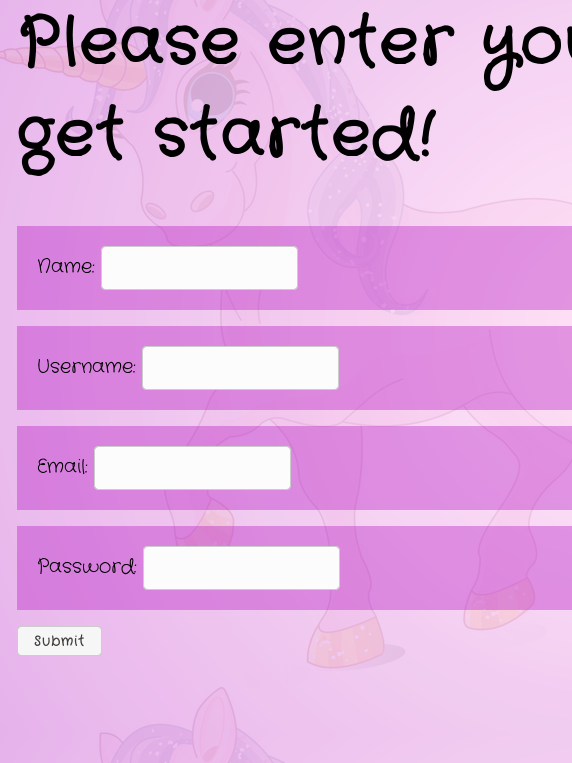
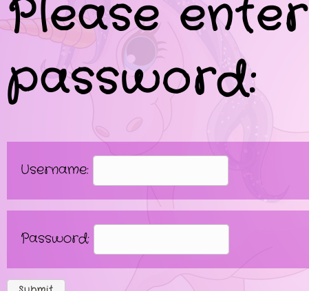
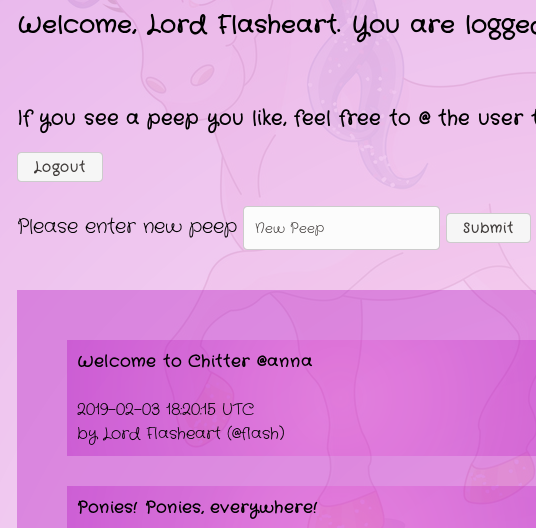

Welcome to Chitter!
-------------

Hope you enjoy my dodgy twitter knockoff!

Original instructions are below; this was completed over a weekend.

Technologies used
-----------

- Sinatra (routing)
- ActiveRecord (database ORM)
- BCrypt (password hashing)
- RSpec (unit testing)
- Capybara (feature testing)
- Pony (email)

Approach
-----

- Strict TDD with red, green refactor approach
    - With the exception of implementing the emailing spec, which I was running out of steam for.
- Approached very methodically with the user stories, refactoring where needed to tidy up the implementation.
- User story 5 is there, I just forgot to change the number in the commit messages :)

Instructions
----

1. Install postgres and set the password for the `postgres` user to `password`
1. Create two databases, `chitter` and `chitter_test`
1. Run `1_create_users_table.sql` and `2_create_peeps_table.sql`; both found in the `migrations` folder (in that order).
1. Create a `.env` file in the project root and populate the following items to allow email sending to work (only tested with a gmail account):
``` 
GMAIL_USER=
GMAIL_PASS=
ADDRESS=smtp.gmail.com
```
1. Install `ruby 2.5.0`.
1. Execute `bundle install` to install all the required gems. 
1. Run the server with `rackup` and browse to `localhost:9292` by default.

You should be greeted by the welcome screen. Peeps are visible, but you are not allowed to post any anonymously:


Users can signup



Or login:



Logged in users are greeted, able to peep and tag other users:



Tagged users receive an email to inform them:


Chitter Challenge
=================

* Challenge time: rest of the day and weekend, until Monday 9am
* Feel free to use Google, your notes, books, etc. but work on your own
* If you refer to the solution of another coach or student, please put a link to that in your README
* If you have a partial solution, **still check in a partial solution**
* You must submit a pull request to this repo with your code by 9am Monday morning

Challenge:
-------

As usual please start by forking this repo.

We are going to write a small Twitter clone that will allow the users to post messages to a public stream.

Features:
-------

```
STRAIGHT UP

As a Maker
So that I can let people know what I am doing  
I want to post a message (peep) to chitter

As a maker
So that I can see what others are saying  
I want to see all peeps in reverse chronological order

As a Maker
So that I can better appreciate the context of a peep
I want to see the time at which it was made

As a Maker
So that I can post messages on Chitter as me
I want to sign up for Chitter

HARDER

As a Maker
So that only I can post messages on Chitter as me
I want to log in to Chitter

As a Maker
So that I can avoid others posting messages on Chitter as me
I want to log out of Chitter

ADVANCED

As a Maker
So that I can stay constantly tapped in to the shouty box of Chitter
I want to receive an email if I am tagged in a Peep
```

Technical Approach:
-----

This week you integrated a database into Bookmark Manager using the `PG` gem and `SQL` queries. You can continue to use this approach when building Chitter Challenge.

If you'd like more technical challenge this weekend, try using an [Object Relational Mapper](https://en.wikipedia.org/wiki/Object-relational_mapping) as the database interface.

Some useful resources:
**DataMapper**
- [DataMapper ORM](https://datamapper.org/)
- [Sinatra, PostgreSQL & DataMapper recipe](http://recipes.sinatrarb.com/p/databases/postgresql-datamapper)

**ActiveRecord**
- [ActiveRecord ORM](https://guides.rubyonrails.org/active_record_basics.html)
- [Sinatra, PostgreSQL & ActiveRecord recipe](http://recipes.sinatrarb.com/p/databases/postgresql-activerecord?#article)


Notes on functionality:
------

* You don't have to be logged in to see the peeps.
* Makers sign up to chitter with their email, password, name and a username (e.g. samm@makersacademy.com, password123, Sam Morgan, sjmog).
* The username and email are unique.
* Peeps (posts to chitter) have the name of the maker and their user handle.
* Your README should indicate the technologies used, and give instructions on how to install and run the tests.

Bonus:
-----

If you have time you can implement the following:

* In order to start a conversation as a maker I want to reply to a peep from another maker.

And/Or:

* Work on the CSS to make it look good.

Good luck and let the chitter begin!

Code Review
-----------

In code review we'll be hoping to see:

* All tests passing
* High [Test coverage](https://github.com/makersacademy/course/blob/master/pills/test_coverage.md) (>95% is good)
* The code is elegant: every class has a clear responsibility, methods are short etc.

Reviewers will potentially be using this [code review rubric](docs/review.md).  Referring to this rubric in advance may make the challenge somewhat easier.  You should be the judge of how much challenge you want this weekend.

Notes on test coverage
----------------------

Please ensure you have the following **AT THE TOP** of your spec_helper.rb in order to have test coverage stats generated
on your pull request:

```ruby
require 'simplecov'
require 'simplecov-console'

SimpleCov.formatter = SimpleCov::Formatter::MultiFormatter.new([
  SimpleCov::Formatter::Console,
  # Want a nice code coverage website? Uncomment this next line!
  # SimpleCov::Formatter::HTMLFormatter
])
SimpleCov.start
```

You can see your test coverage when you run your tests. If you want this in a graphical form, uncomment the `HTMLFormatter` line and see what happens!
